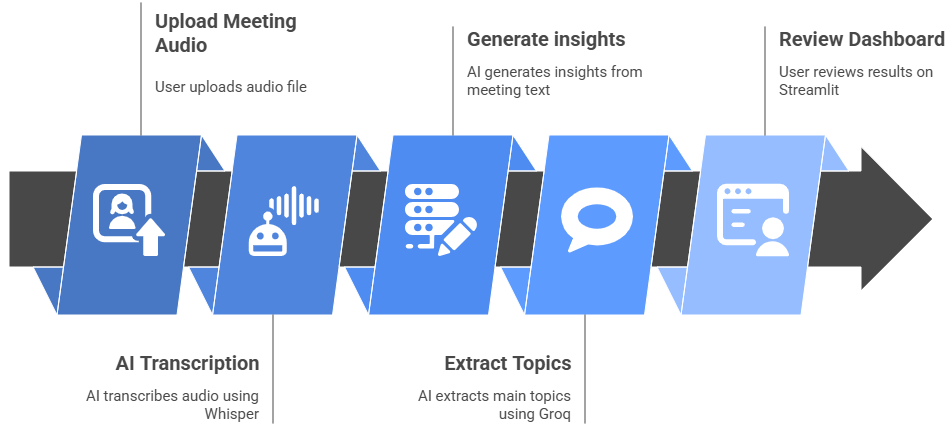

# 💭 MeetingMind – Smart AI Meeting Assistant

## 📌 Project Overview

**MeetingMind** is an intelligent AI assistant designed to transform your meetings into structured knowledge. It helps teams and professionals automatically transcribe, summarize, extract tasks, analyze sentiment, detect topics, and provide research insights — all from raw meeting audio.  

**Audience:**  
- Business teams and project managers  
- Remote work teams  
- Researchers and analysts  
- Anyone who wants to save time by automating meeting documentation  

**How it Works:**  
1. upload your meeting audio.  
2. AI transcribes the conversation using Whisper.  
3. Generate structured summaries, tasks, and sentiment insights using DeepSeek-V3.  
4. Extract the meeting’s primary topic, then leverage Groq to gather relevant online insights and research based on that topic.
5. Review everything through an intuitive Streamlit dashboard.  



## ✨ Features

- **Audio Transcription:** Accurate conversion of speech to text using Whisper.  
- **Meeting Summarization:** Structured summaries with key decisions and discussion points.  
- **Task Extraction:** Identify actionable tasks, responsible persons, and deadlines.  
- **Sentiment Analysis:** Detect emotional tone and highlight key emotions.  
- **Topic Extraction:** Quickly identify the main topic of the meeting.  
- **Research Assistant:** Fetch relevant, trending, and factual online information.  
- **Interactive Dashboard:** Streamlit interface to manage audio, view transcripts, summaries, tasks, sentiment, and research.  

## 🧠 Tech Stack

MeetingMind is built using a modern, high-performance AI stack designed for fast processing, accurate transcription, and powerful meeting insights.

### **Core Technologies**

* **Python** — Primary language powering the backend, processing pipeline, and integrations
* **Whisper** — High-accuracy speech-to-text model used for audio transcription
* **DeepSeek-V3** — Handles advanced summarization, action-item extraction, and sentiment analysis
* **Groq API** — Ultra-fast inference used for web-based research
* **Streamlit** — Interactive dashboard for uploading audio, reviewing transcripts, and exploring insights


## 📂 Folder Structure

```
meetingmind/
│
├── src/
│   ├── dashboard/            # Streamlit app and UI components
│   │   └── app.py            # Main entry point for the dashboard
│   │   └── components.py            
│   │
│   ├── audio/                # Audio enhancement
│   │   └── enhancer.py
│   │
│   ├── transcription/        # Whisper transcription & utilities
│   │   ├── base_transcriber.py
│   │   └── whisper_transcriber.py
│   │   └── utils.py
│   │
│   ├── analysis/             # Summarization, task extraction, sentiment analysis
│   │   ├── summarizer.py
│   │   ├── task_extractor.py
│   │   └── sentiment_analyzer.py
│   │   └── utils.py
│   │
│   ├── research/             # Topic extraction and web search modules
│   │   ├── topic_extractor.py
│   │   └── web_searcher.py
│   │
│   ├── llm/                  # LLM clients (DeepSeek, Gemini, etc.)
│   │   ├── base_llm_client.py
│   │   ├── deepseek_client.py
│   │   └── gemini_client.py
│   │   └── langchain_google_client.py
│   │
│   ├── handlers/             # Error handling, utility decorators, logging
│   │   └── error_handler.py
│   │
│   └── prompt_engineering/   # Prompt templates and loader utilities
│       └── templates.py
│
├── data/                     # Audio, transcripts, and analysis outputs
│   ├── transcripts/          
│   └── analysis_outputs/     
│       ├── summaries/        
│       ├── tasks/            
│       └── sentiment/        
│
├── config/                   # Model and prompt configurations
│   ├── models.yaml           
│   └── prompts.yaml           
│
├── examples/                 # Example audio files and transcripts
│
├── notebooks/                # Jupyter notebooks for experiments and demos
│
├── requirements.txt          # Python dependencies
└── .env                      # Environment variables (API keys)
```

## 🛠 Getting Set Up

Follow these steps to get **MeetingMind – Smart AI Meeting Assistant** up and running on your local machine.

### 1. **Clone the repository**

```bash
git clone https://github.com/BasmaFrajElhadi/meetingmind.git
cd meetingmind
```
### 2. **Install dependencies**

```bash
pip install --upgrade pip
pip install -r requirements.txt
```

### 3. **Set up environment variables**

Create a `.env` file in the project root with your API keys and configuration:

```env
OPENROUTER_API_KEY=your_openrouter_api_key
GROQ_API_KEY=your_groq_api_key
```

> 🔑 Required for AI services.

### 5. **Run the Streamlit dashboard**

```bash
streamlit run src/dashboard/app.py
```

## 📜 License

**Apache License 2.0** – Free to use, modify, and build upon with proper attribution.